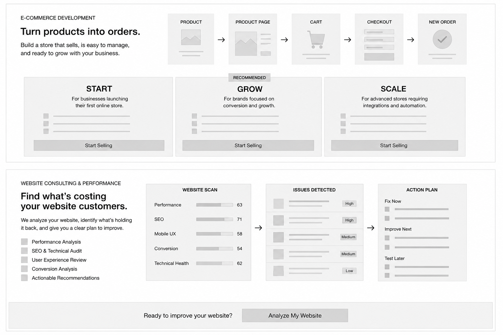

I am redesigning the final two service sections of a Web Services page.

The full page already contains other services, so these two sections must be **compact, clear, and conversion-focused**. Do not make them excessively tall.

I want you to design only these two sections:

1. E-commerce Development
2. Website Consulting & Performance

Focus on **structure, hierarchy, and UX first**.

Do not over-decorate.

The layout should feel modern, premium, and suitable for a professional web-services company.

---

# GLOBAL RULES

Desktop-first layout.

Recommended page/container:

* Desktop width: 1440px
* Content max-width: around 1180–1240px
* Centered content
* Consistent grid
* Strong alignment
* Compact vertical spacing

Design style:

* Clean B2B technology company
* Professional
* Modern
* Minimal
* Strong typography
* Clear cards and sections
* No excessive gradients
* No visual clutter
* No large decorative illustrations that do not explain anything

Important:

The visual should explain the service before the visitor reads everything.

Do not rely on generic laptop mockups.

---

# SECTION 1 — E-COMMERCE DEVELOPMENT

## Main purpose

The customer should immediately understand:

> We do not just build an online catalog.
> We build an online store where customers can easily discover products, buy them, and complete orders.

The core message is:

# Turn products into orders.

Supporting message:

> Build a store that is easy for customers to buy from, easy for your team to manage, and ready to grow with your business.

---

# E-COMMERCE STRUCTURE

The section should have **maximum 3 major parts**:

1. Main service introduction + customer journey visual
2. Main capabilities / operational value
3. CTA or plans depending on final layout

Do not create many subsections.

---

# PART 1 — MAIN INTRO + PURCHASE JOURNEY

Create a wide horizontal section.

Left side:

Small eyebrow:

**E-COMMERCE DEVELOPMENT**

Main heading:

# Turn products into orders.

Short paragraph:

> Build a store that sells, is easy to manage, and is ready to grow with your business.

Keep the copy short.

---

## Right side / Main visual

Create a simple visual flow showing the customer's buying journey.

Use interface-style boxes.

Flow:

### PRODUCT

→

### PRODUCT PAGE

→

### CART

→

### CHECKOUT

→

### NEW ORDER

The final **New Order** card should be slightly more important visually.

Example inside final card:

New Order

Payment successful

Order #1842

Do not use fake revenue numbers unless clearly marked as placeholders.

The point of the visual is to show:

**Product → Purchase**

not technology.

---

# PART 2 — WHAT THE STORE ACTUALLY HANDLES

Under the main visual, create a compact area that tells the business owner what they can manage.

This should NOT become six large cards.

Use either:

* a horizontal feature strip
* a compact grid
* small icon/text items

Include:

### Products

Add, edit, organize, and manage products.

### Orders

View and manage customer orders.

### Payments

Connect payment gateways.

### Shipping

Connect shipping and delivery methods.

### Mobile Shopping

Optimized experience for phone users.

### Integrations

Connect analytics, CRM, email, or other business systems.

The message should feel like:

> Customers can buy easily, and your business can operate the store easily.

---

# SHOULD E-COMMERCE HAVE PLANS?

Do NOT automatically create full pricing cards unless necessary.

E-commerce scope varies heavily depending on:

* product count
* payment gateway
* shipping setup
* countries
* languages
* integrations
* subscriptions
* custom functionality
* ERP/API integrations

Therefore the preferred version should be:

### No full pricing plans.

Instead create a strong CTA such as:

# Ready to start selling online?

Button:

**Request Store Proposal**

Optional secondary text:

**Tell us what you need and we'll recommend the right setup.**

If plans are needed later, leave enough structure so they can be added.

---

# OPTIONAL E-COMMERCE PLAN VERSION

If a plan structure is used, keep it simple.

Three plans:

### START

For businesses launching their first online store.

### GROW

For businesses focused on conversion and growth.

### SCALE

For advanced stores requiring integrations and automation.

If used:

* make GROW slightly highlighted
* do not create massive pricing cards
* keep cards compact
* do not invent prices

But the preferred design is **proposal-based instead of fixed plans**.

---

# E-COMMERCE CUSTOMER THOUGHT

The design should answer:

> Can you build me a store that makes buying easy for customers and running the store easy for me?

---

# SECTION 2 — WEBSITE CONSULTING & PERFORMANCE

This service should look different from E-commerce.

It should feel more analytical, diagnostic, and technical.

Do not make it look like another web-development section.

The customer already has a website.

They are wondering:

> Why is my website not performing properly?

The goal is to communicate:

**We diagnose the problems, show what matters, and tell you what to fix.**

---

# SECTION TITLE

Small eyebrow:

**WEBSITE CONSULTING & PERFORMANCE**

Main heading:

# Find what's costing your website customers.

Alternative:

# Your website may look fine. But is it actually performing?

Supporting paragraph:

> We analyze your website, identify what's holding it back, and give you a clear plan to improve it.

Keep this short.

---

# WEBSITE CONSULTING STRUCTURE

Maximum 3 major areas:

1. Problem / diagnostic introduction
2. Website scan + issues + action plan
3. CTA

Do not add pricing cards.

This should feel like **one clear audit service**.

---

# PART 1 — WHAT WE ANALYZE

Near the intro text, include a short list.

Use compact check items.

### Performance Analysis

Website speed and technical performance.

### SEO & Technical Audit

Technical issues affecting search visibility.

### User Experience Review

Navigation, clarity, mobile usability, and friction.

### Conversion Analysis

Forms, CTAs, purchase paths, and lead generation.

### Tracking Review

Analytics and conversion tracking.

### Actionable Recommendations

Clear priorities instead of just a technical report.

Do not make each item a large card.

---

# PART 2 — MAIN DIAGNOSTIC VISUAL

This is the most important visual.

Create a horizontal three-step visual:

# WEBSITE SCAN

→

# ISSUES DETECTED

→

# ACTION PLAN

---

## BLOCK 1 — WEBSITE SCAN

Create a dashboard-style grey/card interface.

Show categories such as:

Performance

SEO

Mobile UX

Conversion

Technical Health

Each should have:

* label
* progress bar
* score

Example placeholder/demo scores:

Performance — 63

SEO — 71

Mobile UX — 58

Conversion — 54

Technical Health — 62

Important:

These numbers are visual placeholders only.

Do not imply they are real client results.

---

## BLOCK 2 — ISSUES DETECTED

Show a list of problems found.

Each issue should have:

* small icon/box
* short problem title
* priority badge

Possible priorities:

High

Medium

Low

Example issues:

Slow mobile loading — High

Weak CTA visibility — High

Poor page hierarchy — Medium

Tracking issue — Medium

Minor technical issue — Low

Keep the text generic enough to work as sample data.

---

## BLOCK 3 — ACTION PLAN

Create a clear prioritized action list.

Three groups:

### FIX NOW

Critical problems.

### IMPROVE NEXT

Important improvements.

### TEST LATER

Lower-priority experiments or enhancements.

This is important because the service is not just:

“Here is what's wrong.”

It is:

> Here is what you should do first.

---

# VISUAL FLOW

The design should clearly communicate:

**Scan → Diagnose → Prioritize → Improve**

The customer should understand the entire consulting offer by looking at this flow.

---

# PART 3 — CTA

At the bottom of the section, create one wide CTA area.

Message:

# Ready to improve your website?

Button:

**Analyze My Website**

Optional supporting sentence:

> Get a clear view of what's working, what's not, and what to fix first.

Do NOT create three pricing plans for this service.

The website audit should feel like one clear entry product.

---

# WHY NO PLANS FOR CONSULTING?

The visitor does not yet know what problem they have.

They need diagnosis first.

So do not ask them to choose between:

Starter / Growth / Advanced.

Instead:

### Website Audit

is the entry point.

Later, after the audit, we can sell:

* Optimization
* Redesign
* SEO improvements
* UX improvements
* Performance work
* Ongoing consulting

But those do not need to appear as plans in this section.

---

# CUSTOMER THOUGHT TO ANSWER

For Website Consulting:

> Can you tell me why my website is underperforming, what I should fix first, and whether I actually need a redesign?

If the section communicates that clearly, it works.

---

# VISUAL DIFFERENCE BETWEEN THE TWO SECTIONS

This is important.

They must not feel duplicated.

## E-commerce

More commercial.

Flow:

**Product → Cart → Checkout → Order**

Feeling:

Selling.

Shopping.

Business operation.

---

## Consulting

More analytical.

Flow:

**Website → Scan → Issues → Action Plan**

Feeling:

Diagnosis.

Clarity.

Improvement.

---

# RECOMMENDED FINAL PAGE STRUCTURE

## E-COMMERCE

```text
---------------------------------------------------

E-COMMERCE DEVELOPMENT

Turn products into orders.

Short copy


PRODUCT → PRODUCT PAGE → CART → CHECKOUT → NEW ORDER


Products   Orders   Payments
Shipping   Mobile   Integrations


Ready to start selling online?
[ Request Store Proposal ]

---------------------------------------------------
```

Keep this section relatively compact.

---

# WEBSITE CONSULTING

```text
---------------------------------------------------

WEBSITE CONSULTING & PERFORMANCE

Find what's costing your website customers.

Short copy


What we analyze:

✓ Performance
✓ SEO
✓ UX
✓ Conversion
✓ Tracking


[ WEBSITE SCAN ]
       →
[ ISSUES DETECTED ]
       →
[ ACTION PLAN ]


Ready to improve your website?
[ Analyze My Website ]

---------------------------------------------------
```

---

# IMPORTANT DESIGN RULE

Do not make the interface boxes huge.

The page already contains previous service sections.

The visitor should be able to understand each of these sections in roughly one screen or slightly more on desktop.

Prioritize:

* strong hierarchy
* fast understanding
* compact layout
* business outcome
* simple CTA

Avoid:

* long paragraphs
* excessive plan cards
* large decorative backgrounds
* repeated laptop mockups
* unnecessary sections
* fake metrics
* feature overload
* too many CTA buttons

---

# FINAL OBJECTIVE

For E-commerce, the visitor should leave thinking:

> They can help me turn products into actual online orders.

For Website Consulting, the visitor should leave thinking:

> They can find out what's wrong with my website and tell me exactly what to improve.

Design the sections around those two thoughts.
