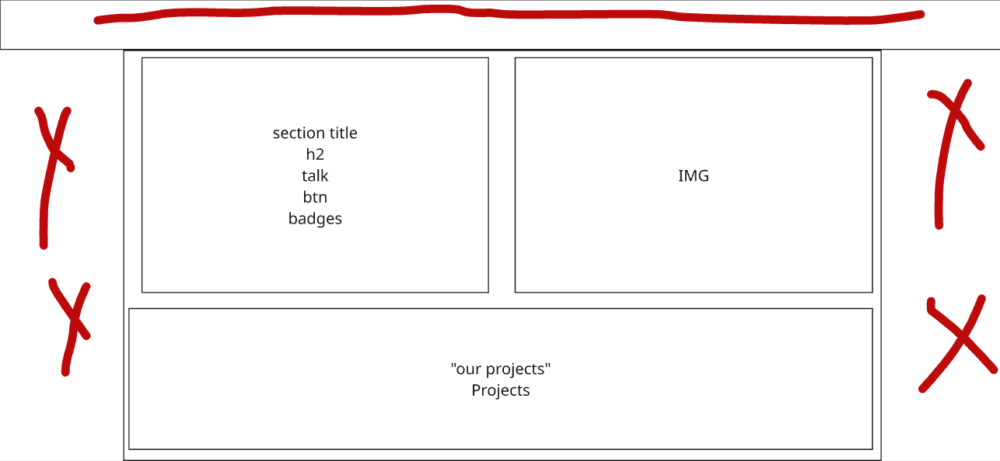

# Homepage Edits

navbar : remove traning from the header

sub navbar : use our colors not black and white 
    when i press a nav btn on the navbar it goes to the section then the sub navbar edit the bg place ,this is not good the delay is not wanted ,make it when i press the bg change imediatly then it goes to the section ,consedring that if i scroll to the section by mouse the bg change as long i reached the section start point

web services section : 
i have some problems with the layout ,it not that orginized i like the style but it not that orginized
layout after orginization => 
do it then we edit UI if needed 

make the projects part a little taller just a tiny bit ,reduce the gap to 3px ,make the border-raduis 3px ,remove the fade on the right and the left sides 
add hover to the image and reduce it border-raduis

in the plans cards i want u to add a virical btn on the side of the card the tell "more" after pressed it give more details 

remove this ستفتح التفاصيل في واتساب لمراجعتها وإرسالها بنفسك. from the 3rd option of plans

app dev section : 
i want like a fade to break the cotrast between this section and the other section around it 

i want the phones to be on the right ,and make them more closer to each other
talk the middle 
features on the left

email services section : 
use our colors
use our btns

ecommerce :
make the whole card as a link
make the taller card same layout like it sisters same thing to the wider one    

Markiting section :
orginize the side part that have the talk 

the بحث جوجل box make it bigger and the load is loading with the scroll the more u reach the section the more it load the 100% when the user reach the full section 
 and اسم شركة متصدر this when is not 100% make it appear ,make it have 3 stages not good -mid - then excellent ,it change with the loader 
 orginize the section in general 

---
> ✅ DONE (2026-09-28), all on /hp-new:
> - navbar: التدريب removed (components/HpNew/HeroNav.js).
> - sub navbar: navy pill with a cyan edge, navy hover. A click highlights the pill IMMEDIATELY and holds it
>   while the page glides (pages/hp-new.js lockRef); scrolling by mouse still switches as each section's top
>   reaches the bar.
> - web services: laid out per image.png: the section title opens the text card (no separate title band),
>   1200px centred container, text card + image as two equal boxes (image float removed), projects across the bottom.
>   Projects: a bit taller, 3px gap, 3px radius, no side fade, hover (zoom + navy wash + cyan edge).
>   Plans: each card shows 3 features + a vertical "المزيد" tab on its side that reveals the rest ("أقل" to close).
>   Custom-dev form: the WhatsApp hint line removed.
> - app dev: phones right (closer, radius 150), talk middle, the 3 points as feature cards left; fades into
>   the light sections above and below.
> - email: navy/cyan instead of black/violet/green/orange; CTA is `.default-btn app-btn-shine`.
> - ecommerce: every card is one link; the tall and wide cards use the same layout as the two squares
>   (the tall one shows the build + manage illustrations side by side).
> - marketing: talk panel organised (label, heading, text, 3-point checklist, site button, quote moved in from
>   the photo). Google card bigger; its meter follows scroll: 0% as the section enters, 100% when it's fully
>   in view. The "اسم شركة متصدر" row is always visible with 3 stages: ضعيف, متوسط, ممتاز (rank 24, 8, 1).
